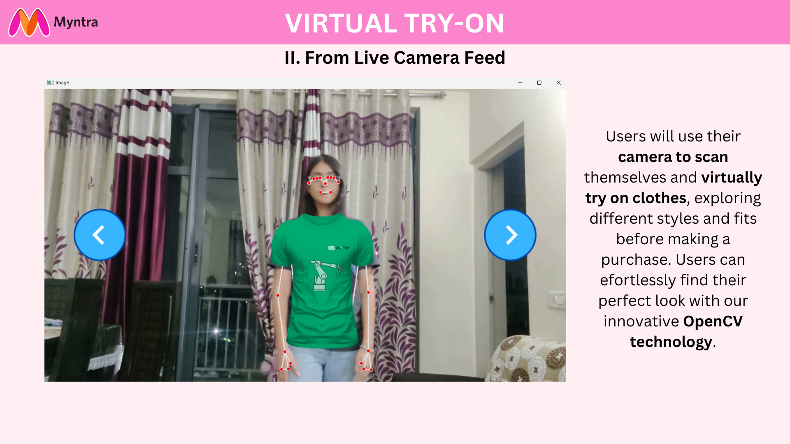
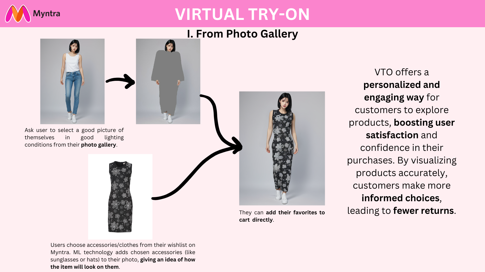

# Virtual Try-On (VTO) Feature for Myntra

## Enhanced Shopping Experience
The Virtual Try-On (VTO) feature offers a personalized and engaging way for customers to explore products, significantly boosting user satisfaction and confidence in their purchases.

## Benefits

### Convenience
Shoppers can try on items from the comfort of their homes, reducing the need for physical store visits.

### Reduced Returns
By visualizing products accurately, customers make more informed choices, leading to fewer returns.

### Innovation and Differentiation
Brands incorporating VTO stand out in the competitive market, appealing especially to tech-savvy Gen Z and Millennial consumers.

## How It Works

### 1. For Live Camera
#### Step 1
Ask users to use their phone camera to scan their face or full body from a distance in good lighting conditions on the Myntra app.

#### Step 2
Users choose accessories/clothes from their wishlist on Myntra. OpenCV technology adds the chosen accessories (like sunglasses or hats) to their live camera view.

#### Step 3
Users can adjust how accessories look and decide which ones they like. They can add their favorites to the cart directly.



### 2. For Photo from Gallery
#### Step 1
Ask users to select a photo in good lighting condition from their gallery.

#### Step 2
Users choose accessories/clothes from their wishlist on Myntra. The chosen accessories (like sunglasses or hats) to their photo.

#### Step 3
Users can adjust how accessories look and decide which ones they like. They can add their favorites to the cart directly.



## Installation For Photo Gallery

1. Clone the repository

```sh
git clone https://github.com/Dahomey-Amazons/Virtual-Try-On.git
```

2. Create a conda environment and install the required packages

```sh
conda create -n myenv python==3.10
conda activate myenv
pip install torch==2.0.1 torchvision==0.15.2 torchaudio==2.0.2
pip install -r requirements.txt
```
3. Please also download clip-vit-large-patch14 into checkpoints folder

## Inference
1. Half-body model

```sh
cd Gallery-Photos/run
python run_ootd.py --model_path <model-image-path> --cloth_path <cloth-image-path> --scale 2.0 --sample 1
```

2. Full-body model 

> Garment category must be paired: 0 = upperbody; 1 = lowerbody; 2 = dress

```sh
cd Gallery-Photos/run
python run_ootd.py --model_path <model-image-path> --cloth_path <cloth-image-path> --model_type dc --category 2 --scale 2.0 --sample 1
```

## Installation For Live Camera

1. Clone the repository

```sh
git clone https://github.com/Dahomey-Amazons/Virtual-Try-On.git
```

2. Create a conda environment and install the required packages

```sh
conda create -n myenv python==3.10
conda activate myenv
pip install cv2 cvzone os
```

3. Change folder paths in main.py. Run main.py.
